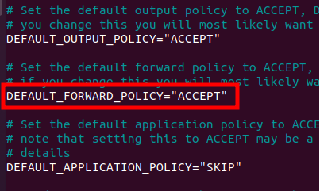
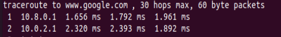

<!DOCTYPE html>

<html lang="pt-BR"><head><meta http-equiv="Content-Type" content="text/html; charset=UTF-8">
   

	
<link rel="dns-prefetch" href="https://www.googletagmanager.com/">
<link rel="dns-prefetch" href="https://pagead2.googlesyndication.com/">
<link rel="alternate" type="application/rss+xml" title="Feed para Simplificando Redes »" href="https://simplificandoredes.com/feed/">
<link rel="alternate" type="application/rss+xml" title="Feed de comentários para Simplificando Redes »" href="https://simplificandoredes.com/comments/feed/">
<link rel="preconnect" href="https://4xgb87.a2cdn1.secureserver.net/" crossorigin="">
<link rel="stylesheet" id="wpo_min-header-0-css" href="./wpo-minify-header-74d14a20.min.css" media="all">
<!--[if IE]>

<![endif]-->

<!-- Snippet do Google Analytics adicionado pelo Site Kit -->

<!-- Finalizar o snippet do Google Analytics adicionado pelo Site Kit -->
<link rel="https://api.w.org/" href="https://simplificandoredes.com/wp-json/"><link rel="alternate" type="application/json" href="https://simplificandoredes.com/wp-json/wp/v2/posts/3713"><link rel="EditURI" type="application/rsd+xml" title="RSD" href="https://simplificandoredes.com/xmlrpc.php?rsd">
<link rel="wlwmanifest" type="application/wlwmanifest+xml" href="https://4xgb87.a2cdn1.secureserver.net/wp-includes/wlwmanifest.xml?time=1669820005">
<link rel="shortlink" href="https://simplificandoredes.com/?p=3713">
<link rel="alternate" type="application/json+oembed" href="https://simplificandoredes.com/wp-json/oembed/1.0/embed?url=https%3A%2F%2Fsimplificandoredes.com%2Finstalar-open-vpn-em-linux%2F">
<link rel="alternate" type="text/xml+oembed" href="https://simplificandoredes.com/wp-json/oembed/1.0/embed?url=https%3A%2F%2Fsimplificandoredes.com%2Finstalar-open-vpn-em-linux%2F&amp;format=xml">
<meta name="generator" content="Site Kit by Google 1.88.0">
<!-- Snippet do Google Adsense adicionado pelo Site Kit -->
<meta name="google-adsense-platform-account" content="ca-host-pub-2644536267352236">
<meta name="google-adsense-platform-domain" content="sitekit.withgoogle.com">
<!-- Finalizar o snippet do Google Adsense adicionado pelo Site Kit -->

<!-- Snippet do Google Adsense adicionado pelo Site Kit -->

<!-- Finalizar o snippet do Google Adsense adicionado pelo Site Kit -->
<link rel="icon" href="https://4xgb87.a2cdn1.secureserver.net/wp-content/uploads/2021/10/SR-1-e1634324327663.png?time=1669820005" sizes="32x32">
<link rel="icon" href="https://4xgb87.a2cdn1.secureserver.net/wp-content/uploads/2021/10/SR-1-e1634324327663.png?time=1669820005" sizes="192x192">
<link rel="apple-touch-icon" href="https://4xgb87.a2cdn1.secureserver.net/wp-content/uploads/2021/10/SR-1-e1634324327663.png?time=1669820005">
<meta name="msapplication-TileImage" content="https://4xgb87.a2cdn1.secureserver.net/wp-content/uploads/2021/10/SR-1-e1634324327663.png?time=1669820005">
<meta http-equiv="origin-trial" content="Az6AfRvI8mo7yiW5fLfj04W21t0ig6aMsGYpIqMTaX60H+b0DkO1uDr+7BrzMcimWzv/X7SXR8jI+uvbV0IJlwYAAACFeyJvcmlnaW4iOiJodHRwczovL2RvdWJsZWNsaWNrLm5ldDo0NDMiLCJmZWF0dXJlIjoiUHJpdmFjeVNhbmRib3hBZHNBUElzIiwiZXhwaXJ5IjoxNjgwNjUyNzk5LCJpc1N1YmRvbWFpbiI6dHJ1ZSwiaXNUaGlyZFBhcnR5Ijp0cnVlfQ=="><meta http-equiv="origin-trial" content="A+USTya+tNvDPaxUgJooz+LaVk5hPoAxpLvSxjogX4Mk8awCTQ9iop6zJ9d5ldgU7WmHqBlnQB41LHHRFxoaBwoAAACLeyJvcmlnaW4iOiJodHRwczovL2dvb2dsZXN5bmRpY2F0aW9uLmNvbTo0NDMiLCJmZWF0dXJlIjoiUHJpdmFjeVNhbmRib3hBZHNBUElzIiwiZXhwaXJ5IjoxNjgwNjUyNzk5LCJpc1N1YmRvbWFpbiI6dHJ1ZSwiaXNUaGlyZFBhcnR5Ijp0cnVlfQ=="><meta http-equiv="origin-trial" content="A7FovoGr67TUBYbnY+Z0IKoJbbmRmB8fCyirUGHavNDtD91CiGyHHSA2hDG9r9T3NjUKFi6egL3RbgTwhhcVDwUAAACLeyJvcmlnaW4iOiJodHRwczovL2dvb2dsZXRhZ3NlcnZpY2VzLmNvbTo0NDMiLCJmZWF0dXJlIjoiUHJpdmFjeVNhbmRib3hBZHNBUElzIiwiZXhwaXJ5IjoxNjgwNjUyNzk5LCJpc1N1YmRvbWFpbiI6dHJ1ZSwiaXNUaGlyZFBhcnR5Ijp0cnVlfQ=="><link rel="preload" href="./f(4).txt" as="script"><link rel="preload" href="./f(5).txt" as="script"><f"><link rel="preload" href="./f(4).txt" as="script"><link rel="preload" href="./f(5).txt" as="script"><link rel="preload" href="./f(4).txt" as="script"><link rel="preload" href="./f(5).txt" as="script"><link rel="preload" href="./f(4).txt" as="script"><link rel="preload" href="./f(5).txt" as="script"><link rel="preload" href="./f(4).txt" as="script"><link rel="preload" href="./f(5).txt" as="script"><link rel="preload" href="./f(4).txt" as="script"><link rel="preload" href="./f(5).txt" as="script"><link rel="preload" href="./f(4).txt" as="script"><link rel="preload" href="./f(5).txt" as="script"><link rel="preload" href="./f(4).txt" as="script"><link rel="preload" href="./f(5).txt" as="script"><link rel="preload" href="./f(4).txt" as="script"><link rel="preload" href="./f(5).txt" as="script"></head>

<body itemtype="https://schema.org/Blog" itemscope="itemscope" class="post-template-default single single-post postid-3713 single-format-standard wp-custom-logo group-blog ast-blog-single-style-1 ast-single-post ast-inherit-site-logo-transparent ast-hfb-header ast-desktop ast-separate-container ast-two-container ast-right-sidebar astra-3.9.4 ast-normal-title-enabled ast-mouse-clicked" style="padding: 0px;" bis_register="W3sibWFzdGVyIjp0cnVlLCJleHRlbnNpb25JZCI6ImVwcGlvY2VtaG1ubGJoanBsY2drb2ZjaWllZ29tY29uIiwiYWRibG9ja2VyU3RhdHVzIjp7IkRJU1BMQVkiOiJkaXNhYmxlZCIsIkZBQ0VCT09LIjoiZGlzYWJsZWQiLCJUV0lUVEVSIjoiZGlzYWJsZWQiLCJSRURESVQiOiJkaXNhYmxlZCJ9LCJ2ZXJzaW9uIjoiMS45LjAzIiwic2NvcmUiOjEwOTAzfV0=" aria-hidden="false">
<svg xmlns="http://www.w3.org/2000/svg" viewBox="0 0 0 0" width="0" height="0" focusable="false" role="none" style="visibility: hidden; position: absolute; left: -9999px; overflow: hidden;"><defs><filter id="wp-duotone-dark-grayscale"><fecolormatrix color-interpolation-filters="sRGB" type="matrix" values=" .299 .587 .114 0 0 .299 .587 .114 0 0 .299 .587 .114 0 0 .299 .587 .114 0 0 "></fecolormatrix><fecomponenttransfer color-interpolation-filters="sRGB"><fefuncr type="table" tableValues="0 0.49803921568627"></fefuncr><fefuncg type="table" tableValues="0 0.49803921568627"></fefuncg><fefuncb type="table" tableValues="0 0.49803921568627"></fefuncb><fefunca type="table" tableValues="1 1"></fefunca></fecomponenttransfer><fecomposite in2="SourceGraphic" operator="in"></fecomposite></filter></defs></svg><svg xmlns="http://www.w3.org/2000/svg" viewBox="0 0 0 0" width="0" height="0" focusable="false" role="none" style="visibility: hidden; position: absolute; left: -9999px; overflow: hidden;"><defs><filter id="wp-duotone-grayscale"><fecolormatrix color-interpolation-filters="sRGB" type="matrix" values=" .299 .587 .114 0 0 .299 .587 .114 0 0 .299 .587 .114 0 0 .299 .587 .114 0 0 "></fecolormatrix><fecomponenttransfer color-interpolation-filters="sRGB"><fefuncr type="table" tableValues="0 1"></fefuncr><fefuncg type="table" tableValues="0 1"></fefuncg><fefuncb type="table" tableValues="0 1"></fefuncb><fefunca type="table" tableValues="1 1"></fefunca></fecomponenttransfer><fecomposite in2="SourceGraphic" operator="in"></fecomposite></filter></defs></svg><svg xmlns="http://www.w3.org/2000/svg" viewBox="0 0 0 0" width="0" height="0" focusable="false" role="none" style="visibility: hidden; position: absolute; left: -9999px; overflow: hidden;"><defs><filter id="wp-duotone-purple-yellow"><fecolormatrix color-interpolation-filters="sRGB" type="matrix" values=" .299 .587 .114 0 0 .299 .587 .114 0 0 .299 .587 .114 0 0 .299 .587 .114 0 0 "></fecolormatrix><fecomponenttransfer color-interpolation-filters="sRGB"><fefuncr type="table" tableValues="0.54901960784314 0.98823529411765"></fefuncr><fefuncg type="table" tableValues="0 1"></fefuncg><fefuncb type="table" tableValues="0.71764705882353 0.25490196078431"></fefuncb><fefunca type="table" tableValues="1 1"></fefunca></fecomponenttransfer><fecomposite in2="SourceGraphic" operator="in"></fecomposite></filter></defs></svg><svg xmlns="http://www.w3.org/2000/svg" viewBox="0 0 0 0" width="0" height="0" focusable="false" role="none" style="visibility: hidden; position: absolute; left: -9999px; overflow: hidden;"><defs><filter id="wp-duotone-blue-red"><fecolormatrix color-interpolation-filters="sRGB" type="matrix" values=" .299 .587 .114 0 0 .299 .587 .114 0 0 .299 .587 .114 0 0 .299 .587 .114 0 0 "></fecolormatrix><fecomponenttransfer color-interpolation-filters="sRGB"><fefuncr type="table" tableValues="0 1"></fefuncr><fefuncg type="table" tableValues="0 0.27843137254902"></fefuncg><fefuncb type="table" tableValues="0.5921568627451 0.27843137254902"></fefuncb><fefunca type="table" tableValues="1 1"></fefunca></fecomponenttransfer><fecomposite in2="SourceGraphic" operator="in"></fecomposite></filter></defs></svg><svg xmlns="http://www.w3.org/2000/svg" viewBox="0 0 0 0" width="0" height="0" focusable="false" role="none" style="visibility: hidden; position: absolute; left: -9999px; overflow: hidden;"><defs><filter id="wp-duotone-midnight"><fecolormatrix color-interpolation-filters="sRGB" type="matrix" values=" .299 .587 .114 0 0 .299 .587 .114 0 0 .299 .587 .114 0 0 .299 .587 .114 0 0 "></fecolormatrix><fecomponenttransfer color-interpolation-filters="sRGB"><fefuncr type="table" tableValues="0 0"></fefuncr><fefuncg type="table" tableValues="0 0.64705882352941"></fefuncg><fefuncb type="table" tableValues="0 1"></fefuncb><fefunca type="table" tableValues="1 1"></fefunca></fecomponenttransfer><fecomposite in2="SourceGraphic" operator="in"></fecomposite></filter></defs></svg><svg xmlns="http://www.w3.org/2000/svg" viewBox="0 0 0 0" width="0" height="0" focusable="false" role="none" style="visibility: hidden; position: absolute; left: -9999px; overflow: hidden;"><defs><filter id="wp-duotone-magenta-yellow"><fecolormatrix color-interpolation-filters="sRGB" type="matrix" values=" .299 .587 .114 0 0 .299 .587 .114 0 0 .299 .587 .114 0 0 .299 .587 .114 0 0 "></fecolormatrix><fecomponenttransfer color-interpolation-filters="sRGB"><fefuncr type="table" tableValues="0.78039215686275 1"></fefuncr><fefuncg type="table" tableValues="0 0.94901960784314"></fefuncg><fefuncb type="table" tableValues="0.35294117647059 0.47058823529412"></fefuncb><fefunca type="table" tableValues="1 1"></fefunca></fecomponenttransfer><fecomposite in2="SourceGraphic" operator="in"></fecomposite></filter></defs></svg><svg xmlns="http://www.w3.org/2000/svg" viewBox="0 0 0 0" width="0" height="0" focusable="false" role="none" style="visibility: hidden; position: absolute; left: -9999px; overflow: hidden;"><defs><filter id="wp-duotone-purple-green"><fecolormatrix color-interpolation-filters="sRGB" type="matrix" values=" .299 .587 .114 0 0 .299 .587 .114 0 0 .299 .587 .114 0 0 .299 .587 .114 0 0 "></fecolormatrix><fecomponenttransfer color-interpolation-filters="sRGB"><fefuncr type="table" tableValues="0.65098039215686 0.40392156862745"></fefuncr><fefuncg type="table" tableValues="0 1"></fefuncg><fefuncb type="table" tableValues="0.44705882352941 0.4"></fefuncb><fefunca type="table" tableValues="1 1"></fefunca></fecomponenttransfer><fecomposite in2="SourceGraphic" operator="in"></fecomposite></filter></defs></svg><svg xmlns="http://www.w3.org/2000/svg" viewBox="0 0 0 0" width="0" height="0" focusable="false" role="none" style="visibility: hidden; position: absolute; left: -9999px; overflow: hidden;"><defs><filter id="wp-duotone-blue-orange"><fecolormatrix color-interpolation-filters="sRGB" type="matrix" values=" .299 .587 .114 0 0 .299 .587 .114 0 0 .299 .587 .114 0 0 .299 .587 .114 0 0 "></fecolormatrix><fecomponenttransfer color-interpolation-filters="sRGB"><fefuncr type="table" tableValues="0.098039215686275 1"></fefuncr><fefuncg type="table" tableValues="0 0.66274509803922"></fefuncg><fefuncb type="table" tableValues="0.84705882352941 0.41960784313725"></fefuncb><fefunca type="table" tableValues="1 1"></fefunca></fecomponenttransfer><fecomposite in2="SourceGraphic" operator="in"></fecomposite></filter></defs></svg>

			<header class="site-header ast-primary-submenu-animation-fade header-main-layout-1 ast-primary-menu-enabled ast-logo-title-inline ast-hide-custom-menu-mobile ast-builder-menu-toggle-icon ast-mobile-header-inline" id="masthead" itemtype="https://schema.org/WPHeader" itemscope="itemscope" itemid="#masthead">
			 

		
		

	

		
					
				

<article class="post-3713 post type-post status-publish format-standard hentry category-rede category-seguranca-redes category-vpn-pt tag-como-configurar-openvpn tag-como-instalar-openvpn tag-como-instalar-servidor-openvpn tag-como-instalar-servidor-openvpn-em-linux tag-como-instalar-servidor-openvpn-em-ubuntu tag-o-que-e-openvpn tag-open-vpn-server tag-open-vpn-ubuntu tag-openvepn-versao tag-openvpn tag-openvpn-cliente tag-openvpn-connect tag-openvpn-donwload tag-openvpn-linux tag-openvpn-servidor tag-openvpn-tls-crypt-v2 tag-openvpn-ubuntu tag-openvpn-ubuntu20 tag-tutorial-instalacao-openvpn ast-article-single" id="post-3713" itemtype="https://schema.org/CreativeWork" itemscope="itemscope" style="height: auto !important;">

	
	

	
	

		
		
	

	
	

		
		

Vamos instalar o servidor Open VPN em uma máquina Linux com o Ubuntu. Além disso, vamos utilizar&nbsp; o TLS Crypt v2 possibilita o fornecimento de uma chave tls-crypt específica para cada cliente.&nbsp;

Ao final do artigo, apresentaremos também a instalação do Open VPN no cliente e a configuração do cliente VPN.&nbsp;

<h2><strong>Instalação do Open VPN</strong>&nbsp;</h2>

Inicialmente vamos instalar o openvpn. Dependendo da data da instalação o repositório já pode conter a versão openvpn ou maior. Em nosso caso, ainda não está no repositório conforme podemos verificar.&nbsp;

<pre class="wp-block-code"><code><strong>sudo apt-get update &amp;&amp; sudo apt-get install openvpn&nbsp;</strong></code></pre>

<pre class="wp-block-code"><code><strong>sudo apt install easy-rsa</strong>&nbsp;</code></pre>

<h3><strong>Verificando a Versão do Open VPN</strong>&nbsp;</h3>

Podemos observar que até o momento a versão que está no repositório do ubuntu é a 2.4.7. No entanto, precisamos da versão 2.5 ou maior.&nbsp;

Para verificar a versão pode usar o comando :&nbsp;

<pre class="wp-block-code"><code><strong>openvpn --version&nbsp;</strong></code></pre>

<figure class="wp-block-image size-full"><figcaption>Install openvpn</figcaption></figure>

<h3>Instalando a versão mais nova do OpenVPN</h3>

Dessa forma, vamos acessar o site de repositório do openvn e vamos fazer a modificação do repositório.

<a href="https://community.openvpn.net/openvpn/wiki/OpenvpnSoftwareRepos" target="_blank" rel="noreferrer noopener">https://community.openvpn.net/openvpn/wiki/OpenvpnSoftwareRepos</a>

<ins data-ad-format="auto" class="adsbygoogle adsbygoogle-noablate" data-ad-client="ca-pub-1186087640573189" data-adsbygoogle-status="done" style="display: block; margin: auto; background-color: transparent; height: 280px;" data-ad-status="filled">

</ins>

Em nossa instalação, estamos usando Ubuntu. Portanto vamos usar os comandos abaixo:

<pre class="wp-block-code"><code><strong>sudo -s</strong></code></pre>

<pre class="wp-block-code"><code><strong>wget -O - https://swupdate.openvpn.net/repos/repo-public.gpg|apt-key add -</strong></code></pre>

Vamos usar o comando “echo “deb http://build.openvpn.net/debian/openvpn/ main” &gt; /etc/apt/sources.list.d/openvpn-aptrepo.list” substituindo o pela versão do openvpn = 2.5 e vamos substituir o por focal, já que estamos usando o ubuntu 20.04.

<pre class="wp-block-code"><code><strong>echo "deb http://build.openvpn.net/debian/openvpn/release/2.5 focal main" &gt; /etc/apt/sources.list.d/openvpn-aptrepo.list</strong></code></pre>

<pre class="wp-block-code"><code><strong>apt-get update &amp;&amp; apt-get install openvpn</strong></code></pre>

Agora, vamos utilizar o comando para ver a versão do openvpn.

<pre class="wp-block-code"><code><strong>openvpn --version</strong></code></pre>

Podemos ver na figura abaixo que já estamos com uma versão do openvpn maior ou igual a 2.5.

<figure class="wp-block-image size-full"><figcaption>openvpn –version</figcaption></figure>

<h2>Criando um diretório para o easy-rsa</h2>

Agora vamos criar um diretório para o ease-rsa e vamso criar links simbólicos. Usaremos links simbólicos para que futuras atualizações possam ser replicadas para nossas configurações.

Inicialmente vamos sair do modo root do terminal. Para isso, podemos dar o comando exit.

<pre class="wp-block-code"><code>exit</code></pre>

Agora vamos criar o diretório easy-rsa

<pre class="wp-block-code"><code>mkdir ~/easy-rsa</code></pre>

Criando o link simbólico para /usr/share/easy-rsa/* .

<pre class="wp-block-code"><code>ln -s /usr/share/easy-rsa/* ~/easy-rsa/</code></pre>

Agora, vamos acessar o diretório que criamos e vamos verificar se os links simbólicos já estão lá.

<pre class="wp-block-code"><code>cd ~/easy-rsa/</code></pre>

<pre class="wp-block-code"><code>ls</code></pre>

<h2>Inicializando o PKI</h2>

Agora vamos inicializar o PKI dentro do diretório que acabamos de criar.

<pre class="wp-block-code"><code>cd ~/easy-rsa/</code></pre>

<pre class="wp-block-code"><code>./easyrsa init-pki</code></pre>

Veremos uma mensagem como a mostrada abaixo. Essa mensagem mostra que estamos prontos para criar a CA Certificate Authority. A CA será a Autoridade Certificadora responsável por validar os certificados.

<figure class="wp-block-image size-full is-resized"><figcaption>wasyrsa init-pki</figcaption></figure>

Observação: Neste tutorial, estamos criando a CA dentro do servidor VPN por uma questão de simplicidade e praticidade. No entanto, a CA pode estar em um outro servidor separado. Além disso, existem argumentos relacionados à segurança que pode motivar a separar um servidor CA somente para ter a função de validar certificados.

<h2>Criando a CA Certificate Authority</h2>

Ao criar a CA teremos a opção de preencher alguns campos. O campo principal é o common name . Dessa forma esse campo common name será o único que vamos preencher nessa configuração. O nosso campo common name terá o valor “VPN_CA”. No entanto, você pode usar outro nome.

Além disso vamos usar a opção “nopass” para evitar que tenhamos que usar password quando formos assinar um certificado. Se desejar, você pode optar por requisitar um password toda vez que assinar, apenas retire a opção “nopass”.

Para criar a CA, vamos usar o comando abaixo:

<pre class="wp-block-code"><code>./easyrsa build-ca nopass</code></pre>

Após o comando, teremos uma mensagem semelhante a abaixo:

<pre class="wp-block-verse has-white-color has-ast-global-color-0-background-color has-text-color has-background">“...

CA creation complete and you may now import and sign cert requests. 

Your new CA certificate file for publishing is at: 

/home/redes/easy-rsa/pki/ca.crt  

...“ </pre>

Podemos entrar no nosso diretório para verificar os novos arquivos:&nbsp;

<pre class="wp-block-code"><code>cd ~/easy-rsa/pki  </code></pre>

<pre class="wp-block-code"><code>ls </code></pre>

Podemos verificar que existe agora um arquivo chamado ca.crt . Futuramente, vamos utilizar esse arquivo.&nbsp;

Podemos também verificar a chave privada da nossa CA. Usando o comando abaixo:&nbsp;

<pre class="wp-block-code"><code>ls ~/easy-rsa/pki/private </code></pre>

<figure class="wp-block-image size-full is-resized"><figcaption>ca.key</figcaption></figure>

<h2>Criando a chave do servidor OpenVPN</h2>

Para criar a chave do servidor OpenVPN, vamos entrar no diretório ~/easy-rsa/ e usar o comando para cirar a chave:

<pre class="wp-block-code"><code>cd ~/easy-rsa/</code></pre>

<pre class="wp-block-code"><code>./easyrsa build-server-full vpn_server nopass</code></pre>

Após digitar esse comando, você verá um resultado semelhante ao apresentado na figura abaixo:

<figure class="wp-block-image size-full is-resized"><figcaption>rsa vpn server</figcaption></figure>

Agora ao listar o conteúdo do diretório ~/easy-rsa/pki/private/ podemos ver que temos uma nova chave = “vpn_server.key”.

<figure class="wp-block-image size-full is-resized"><figcaption>vpn server key</figcaption></figure>

Podemos também verificar o certificado criado para o servidor VPN. Para isso, podemo usar o comando abaixo:

<pre class="wp-block-code"><code>ls ~/easy-rsa/pki/issued</code></pre>

<figure class="wp-block-image size-full is-resized"><figcaption>vpn_server.crt</figcaption></figure>

<h2>Assinando o certificado do servidor OpenVPN</h2>

Agora precisamos assinar o certificado do servidor Open VPN. Então, para assinar o certificado do servidor Open VPN , vamos entrar no diretório ~/easy-rsa e em seguida digitar o comando abaixo:

<pre class="wp-block-code"><code>cd ~/easy-rsa/</code></pre>

<pre class="wp-block-code"><code>./easyrsa sign-req server vpn_server</code></pre>

Após o comando veremos um resultado semelhante ao da figura abaixo:

<figure class="wp-block-image size-full"><figcaption>sign vpn server</figcaption></figure>

<h2>Gerando o parâmetro Diffie hellman</h2>

Para gerar os parâmetros Diffie hellman vamos para o diretório ~/easy-rsa/ e em seguida vamos executar o comando para gerar o DH.

<pre class="wp-block-code"><code>cd ~/easy-rsa/</code></pre>

<pre class="wp-block-code"><code>./easyrsa gen-dh</code></pre>

A figura abaixo mostra o resultado após executar o comando para gerar o Diffie hellman.

<figure class="wp-block-image size-full"><figcaption>generate diffie hellman</figcaption></figure>

<h2>Criando um TLS Crypt v2 para o OpenVPN</h2>

Usaremos o TLS Crypt v2 possibilita o fornecimento de uma chave tls-crypt específica para cada cliente. Dessa forma, podemos reduzir os danos caso a chave tls-crypt de um cliente venha a ser comprometida. Isso porque, se um cliente tivesse sua tls-crypt exposta, apenas a tls-crypt desse cliente representaria um risco de segurança.

Vale lembrar que <code>--tls-auth</code> e <code>tls-crypt</code> usam uma chave de grupo pré-compartilhada, que é compartilhada entre todos os clientes e servidores em uma implantação OpenVPN. Dessa forma, se algum cliente for comprometido, o invasor terá acesso a essa chave compartilhada e consequentemente prejudicará a segurança.

<h3>Criando a chave TLS Crypt v2 para o servidor Open VPN</h3>

Agora vamos criar a chave TLS Crypt v2 que será usada pelo servidor Open VPN. Assim, inicialmente vamos entrar no diretório “~/easy-rsa/pki/”.

<pre class="wp-block-code"><code>cd ~/easy-rsa/pki/</code></pre>

Depois disso, vamos digitar o comando abaixo:

<pre class="wp-block-code"><code>openvpn --genkey tls-crypt-v2-server private/vpn_server.pem</code></pre>

Caso queira, você pode verificar que foi criada uma chave vpn_server.pem no diretório “~/easy-rsa/pki/private/”.

Você pode verificar usando o comando :

<pre class="wp-block-code"><code>ls ~/easy-rsa/pki/private/</code></pre>

<h2>Configurando o servidor Open VPN</h2>

Inicialmente vamos para o diretório /etc/openvpn/server, usaremos o comando:

<pre class="wp-block-code"><code>cd /etc/openvpn/server</code></pre>

Em seguida, vamos criar um arquivo com o nome de server.conf. 

<pre class="wp-block-code"><code>sudo nano server.conf</code></pre>

Nesse arquivo, vamos adicionar as linhas de configuração abaixo:

<pre class="wp-block-code"><code>#-------------------- 
#VPN port
port 1194   

#VPN over UDP  
proto udp   

# "dev tun" will create a routed IP tunnel 
dev tun 

ca ca.crt 
cert vpn_server.crt 
key vpn_server.key   
tls-crypt-v2 vpn_server.pem 
dh dh.pem 

#network for the VPN   
server 10.8.0.0 255.255.255.0 

push "redirect-gateway autolocal" 

# Maintain a record of client &lt;-&gt; virtual IP address 

# associations in this file.  
ifconfig-pool-persist /var/log/openvpn/ipp.txt

# Ping every 10 seconds and assume client is down if 
# it receives no response in 120 seconds. 
keepalive 10 120 

#cryptographic cipher 
cipher AES-256-GCM 

#avoid accessing certain resources on restart 
persist-key 
persist-tun 

#log of current connections  
status /var/log/openvpn/openvpn-status.log 

#log verbose level (0-9) 
verb 4 

# Notify the client when the server restarts 
explicit-exit-notify 1 
#----------------------------------------- </code></pre>

<h3>Explicando as linhas de configuração do server.conf</h3>

Agora, vamos descrever as linhas de configuração usadas. Inicialmente temos a linha <strong>“port 1194” </strong>que indica a porta que o servidor usará para o OpenVPN.

Depois disso, temos a linha <strong>“proto udp”</strong> que indica que nossa VPN vai usar o protocolo da camada de transporte UDP.

<ins data-ad-format="auto" class="adsbygoogle adsbygoogle-noablate" data-ad-client="ca-pub-1186087640573189" data-adsbygoogle-status="done" style="display: block; margin: auto; background-color: transparent; height: 280px;" data-ad-status="filled">

</ins>

 Em seguida, temos a linha<strong> “dev tun”</strong> que indica que usaremos um túnel de rotas IP para a VPN.

Depois disso, vamos começar a indicar o certificado da autoridade certificadora usando a linha <strong>“ca ca.crt“</strong>, nesse caso o arquivo é o “ca.crt”. Neste exemplo a autoridade certificadora também está na mesma máquina do servidor VPN.

<ins data-ad-format="auto" class="adsbygoogle adsbygoogle-noablate" data-ad-client="ca-pub-1186087640573189" data-adsbygoogle-status="done" style="display: block; margin: auto; background-color: transparent; height: 280px;" data-ad-status="filled">

</ins>

Agora vamos informar qual é o nosso arquivo que tem o certificado do servidor VPN =<strong> “cert vpn_server.crt”</strong>. Lembre-se que criamos nosso certificado com o nome vpn_server.crt. Se você usou outro nome, lembre-se de alterar para o nome que você usou.

A próxima linha <strong>“key vpn_server.key”</strong> indica a chave que será usada pelo servidor VPN. Além disso, vale a pena lembrar que essa chave é secreta e deve ser mantida em segredo. Em nosso exemplo, criamos a chave com o nome “vpn_server.key”.

<ins data-ad-format="auto" class="adsbygoogle adsbygoogle-noablate" data-ad-client="ca-pub-1186087640573189" data-adsbygoogle-status="done" style="display: block; margin: auto; background-color: transparent; height: 280px;" data-ad-status="filled">

</ins>

Agora vamos usar a linha <strong>“tls-crypt-v2 server vpn_server.pem”</strong> para apontar para a chave TLS Crypt V2 do servidor OpenVPN. Em nosso caso o nome do arquivo da chave foi o “vpn_server.pem”.

Agora vamos informar o nome do arquivo Diffie hellman = <strong>“dh dh.pem”</strong>. Em nosso caso esse arquivo está com o nome dh.pem.

A próxima linha, <strong>“server 10.8.0.0 255.255.255.0”</strong>, informa o range de IPs que serão usados na VPN. Esse range de IPs pode ser alterado para evitar que coincida com alguma rede interna de sua empresa.

<ins data-ad-format="auto" class="adsbygoogle adsbygoogle-noablate" data-ad-client="ca-pub-1186087640573189" data-adsbygoogle-status="done" style="display: block; margin: auto; background-color: transparent; height: 280px;" data-ad-status="filled">

</ins>

A linha<strong> “push “redirect-gateway autolocal””</strong> força a utilização da VPN como gateway.

Depois temos a linha <strong>“ifconfig-pool-persist /var/log/openvpn/ipp.txt”</strong> que armazena os endereços virtuais dos clientes da VPN.

Em seguida, temos a linha <strong>“keepalive 10 120”</strong> que indica que vamos enviar um ping a cada 10 segundos para os clientes e que se o cliente ficar 120 segundos sem responder será considerado desconectado.

A próxima linha <strong>“cipher AES-256-GCM” </strong>indica qual será a cifra criptográfica usada.

<ins data-ad-format="auto" class="adsbygoogle adsbygoogle-noablate" data-ad-client="ca-pub-1186087640573189" data-adsbygoogle-status="done" style="display: block; margin: auto; background-color: transparent; height: 280px;" data-ad-status="filled">

</ins>

As linhas<strong> “persist-key” </strong>e <strong>“persist-tun”</strong> são usadas para evitar o acesso aos recursos em caso de restart em caso de redução de privilégios.

A linha <strong>“status /var/log/openvpn/openvpn-status.log”</strong> informa onde serão armazenados os logs das conexões em andamento.

Em seguida, temos a linha <strong>“verb 4”</strong> que indica o nivel de detalhamento dos logs. Sendo que o nivel de detalhamento pode variar de 0 até 9.

A última linha , <strong>“explicit-exit-notify 1”</strong>, indica que o servidor VPN vai avisar os clientes caso tenha que ser reinicializado.

<h3>Copiando arquivos para a pasta /etc/openvpn/server</h3>

Agora que já criamos o arquivo de configuração, precisos copiar os arquivos de certificados e chaves do servidor VPN para dentro do diretório “/etc/openvpn/server/”.

<h4><strong>Copiando o ca.crt e o dh.pem</strong></h4>

Inicialmente vamos para o diretório “~/easy-rsa/pki/”.

<pre class="wp-block-code"><code>cd ~/easy-rsa/pki/</code></pre>

Depois vamos copiar o certificado da autoridade certificadora. Em nosso caso é o “ca.crt”.

<pre class="wp-block-code"><code>sudo cp ca.crt /etc/openvpn/server/</code></pre>

Em seguida vamos copiar o arquivo de Diffie hellman. Para isso, vamos copiar o arquivo dh.pem para o diretório “/etc/openvpn/server/”.

<pre class="wp-block-code"><code>sudo cp dh.pem /etc/openvpn/server/</code></pre>

<h4><strong>Copiando o vpn_server.key e vpn_server.pem</strong></h4>

Depois, vamos para o diretório “~/easy-rsa/pki/private/”.

<pre class="wp-block-code"><code>cd ~/easy-rsa/pki/private/</code></pre>

Dentro desse diretório, vamos copiar os arquivos, “vpn_server.key” e “vpn_server.pem”,  necessários para o servidor VPN. Para a copia, usaremos o comando cp.

<pre class="wp-block-code"><code>sudo cp vpn_server.key /etc/openvpn/server/</code></pre>

<pre class="wp-block-code"><code>sudo cp vpn_server.pem /etc/openvpn/server/</code></pre>

<h4><strong>Copiando o vpn_server.crt</strong></h4>

Agora vamos para o diretório onde temos o certificado do servidor open vpn. Nesse caso é o diretório “~/easy-rsa/pki/issued/”.

<pre class="wp-block-code"><code>cd ~/easy-rsa/pki/issued/</code></pre>

Agora vamos copiar o arquivo vpn_server.crt para o diretório “/etc/openvpn/server/”.

<pre class="wp-block-code"><code>sudo cp vpn_server.crt /etc/openvpn/server/</code></pre>

<h2>Permitindo o encaminhamento no servidor Open VPN</h2>

Até agora, fomos muito bem na configuração do servidor Open VPN. Portanto, precisamos habilitar o encaminhamento na máquina que será servidora do Open VPN. Para isso, vamos inserir uma linha no arquivo /etc/sysctl.conf. Dessa forma, vamos usar o comando abaixo para inserir a linha pelo comando:

<pre class="wp-block-code"><code>sudo nano /etc/sysctl.conf</code></pre>

Em seguida vamos adicionar a linha no final do arquivo:

<pre class="wp-block-code"><code>net.ipv4.ip_forward = 1</code></pre>

Você pode me falar: Dalbert essa linha já está no arquivo. A resposta é sim. No entanto, na maioria dos sistemas essa linha vai estar comentada, principalmente se você nunca configurou o servidor para encaminhar pacotes. Dessa forma, se desejar pode descomnentar a linha ao invés de inserir a linha “net.ipv4.ip_forward = 1” .

Agora vamos recarregar o arquivo usando o comando :

<pre class="wp-block-code"><code>sudo sysctl -p</code></pre>

Após digitar o comando acima, podemos ver um resultado semelhante ao da figura abaixo:

<figure class="wp-block-image size-full is-resized"><figcaption>ipv4 forwarding</figcaption></figure>

<h2>Configurando o servidor VPN para fazer NAT</h2>

Depois de toda a configuração inicial, precisamos assegurar que nosso servidor VPN faça NAT corretamente. Isso porque, as conexões dos clientes serão roteadas por ele e usarão um IP diferente do IP da rede do servidor VPN. Dessa forma, precisamos criar algumas regras de NAT no IPTABLES.

Inicialmente precisamos verificar qual é a interface do servidor VPN que encaminha dados para o default gateway. Para isso, vamos usar o comando abaixo:

<pre class="wp-block-code"><code>ip route list default</code></pre>

<figure class="wp-block-image size-full is-resized"><figcaption>find default gateway interface</figcaption></figure>

A figura acima mostra que a interface de nosso servidor VPN que está fazendo o roteamento padrão é a enp0s3 . Portanto vamos usar a interface “enp0s3” . No seu caso, use o nome da interface que aparecer no comando “ip route list default”.

<h3>Inserindo as regras de NAT e redirecionamento para o Open VPN</h3>

Agora vamos editar o arquivo que faz a leitura preliminar das regras do firewall. Para isso vamos editar o arquivo “/etc/ufw/before.rules”. Então, vamos usar o comando abaixo:

<pre class="wp-block-code"><code>sudo nano /etc/ufw/before.rules</code></pre>

Dentro desse arquivo “before.rules”, vamos adicionar as linhas abaixo:

<pre class="wp-block-code"><code>*nat
:POSTROUTING ACCEPT [0:0] 
-A POSTROUTING -s 10.8.0.0/16 -o enp0s3 -j MASQUERADE 
COMMIT</code></pre>

<figure class="wp-block-image size-full is-resized"><figcaption>Nat ifw rules</figcaption></figure>

A figura acima demonstra que devemos inserir essas linhas de configuração no início do arquivo “before.rules”. Dessa forma, essas linhas que inserimos vão permitir o NAT em nosso servidor VPN.

Importante dizer que aqui devemos colocar a rede que estamos usando para VPN. Dessa forma, em nossas configurações usamos a rede “10.8.0.0/16”. Além disso, vamos especificar aquela interface que liga o servidor VPN ao default gateway “enp0s3”.

<h4><strong>Editando o “/etc/default/ufw”</strong></h4>

Agora vamos editar o arquivo “/etc/default/ufw” e alterar uma linha para permitir o redirecionamento. Para isso vamos encontrar a linha “DEFAULT_FORWARD_POLICY=”DROP” “ e vamos alterar para DEFAULT_FORWARD_POLICY=”ACCEPT”. Abaixo, temos a configuração alterada:

<pre class="wp-block-code"><code>sudo nano /etc/default/ufw</code></pre>

<pre class="wp-block-code"><code>DEFAULT_FORWARD_POLICY=”ACCEPT”</code></pre>

<figure class="wp-block-image size-full is-resized"><figcaption>ifw forward rules</figcaption></figure>

<h2>Permitindo acesso ao servidor Open VPN</h2>

Agora, vamos criar uma regra para permitir acesso na porta do servidor Open VPN. Em nosso caso, nosso servidor está operando na porta 1194. Portanto vamos usar a regra abaixo para permitir acesso UDP na porta 1194:

<pre class="wp-block-code"><code>sudo ufw allow 1194/udp</code></pre>

<figure class="wp-block-image size-full is-resized"><figcaption>firewall allow vpn port</figcaption></figure>

<h2>Reiniciando o Firewall</h2>

Depois de alterar as linhas vamos reiniciar o Firewall. Para isso vamos usar os comandos abaixo:

<pre class="wp-block-code"><code>sudo ufw disable</code></pre>

<pre class="wp-block-code"><code>sudo ufw enable</code></pre>

<figure class="wp-block-image size-full is-resized"><figcaption>restart ufw firewall</figcaption></figure>

<h2>Inicializando o servidor Open VPN</h2>

Vamos inicializar o servidor Open VPN. Para isso, vamos executar o comando abaixo:

<pre class="wp-block-code"><code>sudo systemctl start openvpn-server@server.service</code></pre>

Em seguida vamos verificar se o servidor inicializou corretamente com o seguinte comando:

<pre class="wp-block-code"><code>sudo systemctl status openvpn-server@server.service</code></pre>

A figura abaixo mostra o resultado do status do servidor OpenVPN.

<figure class="wp-block-image size-full is-resized"><figcaption>start open vpn server</figcaption></figure>

<h2>Configurando o cliente Open VPN</h2>

Depois de configurarmos o servidor Open VPN, vamos iniciar a configuração do cliente Open VPN. Para isso vamos configurar um cliente hipotético chamado Alice. E configuraremos uma outra máquina onde o cliente Alice vai estar usado.

Vale lembrar que estamos usando máquinas virtuais e rede virtualizada para demonstrar a configuração do OpenVPN. No entanto, o mesmo procedimento se aplica para máquinas que estejam usando IPs públicos. Além disso, optamos por usar um cenário virtualizado para que nossos leitores possam replicar o cenário como prova de conceito.

<h3>Criando e assinando o certificado do cliente OpenVPN</h3>

Para criar o certificado do cliente Open VPN , vamos entrar no diretório “~/easy-rsa”, dentro do servidor Open VPN. Em seguida, vamos digitar o comando abaixo:

<pre class="wp-block-code"><code>cd ~/easy-rsa/</code></pre>

<pre class="wp-block-code"><code>./easyrsa gen-req Alice nopass</code></pre>

Lembre-se de pressionar ENTER quando perguntar se deseja usar o Common Name. *Vale lembrar que estamos usando como exemplo um cliente com o nome Alice. Certamente, você fará alterações para os nomes dos seus clientes.

Depois vamos assinar o certificado do cliente Open VPN , utilizando o o comando abaixo:

<pre class="wp-block-code"><code>./easyrsa sign-req client Alice</code></pre>

Confirme a operação com “yes”.

<h3>Criando a chave TLS Crypt v2 para o cliente</h3>

Agora vamos criar a TLS Crypt v2 que será usada pelo cliente.

Nesse tutorial, vamos criar uma chave que será usada pelo cliente Alice.

<ins data-ad-format="auto" class="adsbygoogle adsbygoogle-noablate" data-ad-client="ca-pub-1186087640573189" data-adsbygoogle-status="done" style="display: block; margin: auto; background-color: transparent; height: 280px;" data-ad-status="filled">

</ins>

Para isso, dentro do servidor Open VPN,  vamos entrar no diretório ~/easy-rsa/pki/ .

<pre class="wp-block-code"><code>cd ~/easy-rsa/pki/</code></pre>

Em seguida, vamos digitar o comando abaixo:

<pre class="wp-block-code"><code>openvpn --tls-crypt-v2 private/vpn_server.pem --genkey tls-crypt-v2-client private/Alice.pem</code></pre>

Podemos verificar que a chave para Alice foi criada dentro do diretório ~/easy-rsa/pki/private/.

<pre class="wp-block-code"><code>ls ~/easy-rsa/pki/private/</code></pre>

<figure class="wp-block-image size-full is-resized"><figcaption>open vpn client key</figcaption></figure>

<h3>Preparando os arquivos de clientes Open VPN</h3>

Para configurar o cliente open vpn, vamos precisar criar um diretório onde vamos armazenar os arquivos dos clientes da VPN. Para isso vamos usar o comando abaixo:

<pre class="wp-block-code"><code>mkdir ~/vpn_clients</code></pre>

Dentro desse diretório vamos criar subdiretórios para cada cliente. Em nosso caso, temos o cliente Alice. Então vamos criar um subdiretório alice.

<pre class="wp-block-code"><code>cd ~/vpn_clients</code></pre>

<pre class="wp-block-code"><code>mkdir alice</code></pre>

Agora vamos copiar os arquivos ca.crt e os outros arquivos da Alice para o diretório “~/vpn_clients/alice”. O primeiro arquivo é o ca.crt que está no “~/easy-rsa/pki/” . Então vamos usar o comando abaixo

<pre class="wp-block-code"><code>cd ~/easy-rsa/pki/</code></pre>

<pre class="wp-block-code"><code>cp ca.crt ~/vpn_clients/alice</code></pre>

Agora vamos copiar os arquivos “.crt” e “.key” do cliente. Para isso, vamos para o diretório “~/easy-rsa/pki/issued/”.

<pre class="wp-block-code"><code>cd ~/easy-rsa/pki/issued/</code></pre>

Em seguida vamos copiar o arquivo de certificado de Alice “.crt” para o diretório que criamos para o cliente Alice.

<pre class="wp-block-code"><code>cp Alice.crt ~/vpn_clients/alice</code></pre>

Agora vamos copiar a chave de Alice “.key” e “.pem”. Para isso, vamos para o diretório “~/easy-rsa/pki/private/”.

<pre class="wp-block-code"><code>cd ~/easy-rsa/pki/private/</code></pre>

Depois vamos copiar a chave de Alice “Alice.key” e “Alice.pem” para o diretório da Alice.

<pre class="wp-block-code"><code>cp Alice.key ~/vpn_clients/alice</code></pre>

<pre class="wp-block-code"><code>cp Alice.pem ~/vpn_clients/alice</code></pre>

Agora vamos para o diretório da Alice:

cd ~/vpn_clients/alice

<pre class="wp-block-code"><code>cd ~/vpn_clients/alice</code></pre>

Em seguida vamos dar um comando ls para verificar se os arquivos estão lá.

<pre class="wp-block-code"><code>ls</code></pre>

<figure class="wp-block-image size-full is-resized"><figcaption>open vpn client files</figcaption></figure>

<h3>Criando o arquivo OVPN do Open VPN</h3>

Agora vamos criar o arquivo “make_client_ovpn.sh” dentro do diretório da Alice. Esse arquivo é um script que vai facilitar nossa vida no momento de configurar os clientes. Obviamente, você poderia digitar manualmente as configurações no arquivo “.ovpn” dos clientes. No entanto, aqui sugerimos o script para automatizar a tarefa.

<pre class="wp-block-code"><code>cd ~/vpn_clients/alice</code></pre>

<pre class="wp-block-code"><code>nano make_client_ovpn.sh</code></pre>

Em seguida, vamos copiar e colar as linhas abaixo:

<pre class="wp-block-code"><code>#!/bin/bash 

# 1 argument = Client_identifier
cat &lt;(echo -e 'client') \
&lt;(echo -e 'proto udp') \
&lt;(echo -e 'dev tun') \
&lt;(echo -e 'remote 127.0.0.1 1194') \
&lt;(echo -e 'resolv-retry infinite') \
&lt;(echo -e 'nobind') \
&lt;(echo -e 'persist-key') \
&lt;(echo -e 'persist-tun') \
&lt;(echo -e 'remote-cert-tls server') \
&lt;(echo -e 'cipher AES-256-GCM') \
&lt;(echo -e '#user nobody') \
&lt;(echo -e '#group nobody') \
&lt;(echo -e 'verb 3') \
    &lt;(echo -e '&lt;ca&gt;') \
    ca.crt \
    &lt;(echo -e '&lt;/ca&gt;\n&lt;cert&gt;') \
    ${1}.crt \
    &lt;(echo -e '&lt;/cert&gt;\n&lt;key&gt;') \
    ${1}.key \
    &lt;(echo -e '&lt;/key&gt;\n&lt;tls-crypt-v2&gt;') \
    ${1}.pem \
    &lt;(echo -e '&lt;/tls-crypt-v2&gt;') \
    &gt; ${1}.ovpn 

 </code></pre>

<h4><strong>Explicando as linhas da configuração</strong></h4>

Agora, vamos explicar o significado dessas linhas de configuração do cliente Open VPN:

<strong>“client” </strong>indica que é um cliente Open VPN.

<strong>“proto udp”</strong> indica que vai usar o protocolo UDP

<strong>“dev tun” </strong>indica que vai usar túnel IP

<strong>“remote” 127.0.0.1 1194″ </strong>indica o IP do servidor Open VPN e a porta que será usada. No seu caso, assumindo que você vai usar a VPN na Internet, você deve verificar qual o IP público do seu servidor VPN.

<strong>“resolv-retry infinite”</strong> Indica que vai ficar tentando resolver o nome do servidor VPN

<strong>“nobind”</strong> indica não vai usar uma porta específica.

<strong>“persist-key”</strong> e “persist-tun” permite preservar estado das conexões em caso de reinicialização.

<strong>“remote-cert-tls server”</strong> indica o tls do servidor

<strong>“cipher AES-256-GCM”</strong> indica a cifra de criptografia usada

<strong>“#user nobody”</strong> e <strong>“#group nobody”</strong> Redução de privilégios em clientes não Linux. Remova o “#” se estiver usando um cliente em uma máquina que não use o sistema operacional Linux.

<strong>“verb 3”</strong> indica o nível de detalhamento dos logs.

O resto do script indica que vamos ler os arquivos <strong>“${1}.crt”</strong> + <strong>“${1}.key” </strong>+ <strong>“${1}.pem”</strong> , sendo o “${1}” o nome de identificação que você designou para o cliente. Esse identificador do cliente é primeiro argumento que vamos passar para nosso script.

<h4><strong>Executando o script</strong></h4>

Depois de criado o arquivo make_client_ovpn.sh, vamos torná-lo executável. Para isso vamos usar o comando abaixo:

<pre class="wp-block-code"><code>chmod +x make_client_ovpn.sh</code></pre>

Depois disso vamos executar o arquivo utilizando o “./” e seguido do nome de identificação do cliente. No nosso caso, o cliente é a Alice.

<pre class="wp-block-code"><code>./make_client_ovpn.sh Alice</code></pre>

Você vai perceber que foi criado um arquivo “.ovpn” dentro da pasta da Alice. Pode verificar usando o comando “ls”.

<pre class="wp-block-code"><code>ls</code></pre>

<figure class="wp-block-image size-full is-resized"><figcaption>open vpn client script</figcaption></figure>

<h2><strong>Enviando o arquivo OVPN para o cliente</strong></h2>

Agora vamos copiar o arquivo Alice.ovpn para o computador do cliente. Para isso, podemos usar diversas formas para copiar como por exemplo SFTP, email, pendrive.

<strong>(Opcional)</strong>Vamos usar o netcat para trasnferir o arquivo Alice.ovpn.

<ins data-ad-format="auto" class="adsbygoogle adsbygoogle-noablate" data-ad-client="ca-pub-1186087640573189" data-adsbygoogle-status="done" style="display: block; margin: auto; background-color: transparent; height: 280px;" data-ad-status="filled">

</ins>

Para isso vamos iniciar um servidor netcat na máquina que vai receber o arquivo Alice.ovpn. Para isso vamos usar o comando abaixo:

<pre class="wp-block-code"><code>nc -vnl -w 2 8888 &gt; Alice.ovpn</code></pre>

Esse comando informa que o computador vai ouvir na porta 8888 e vai jogar o conteúdo recebido dentro do arquivo Alice.ovpn.

Agora vamos para a máquina servidor VPN e vamos para a pasta da Alice. Em seguida vamos digitar o seguinte comando:

<pre class="wp-block-code"><code>nc -vn 10.0.2.15 8888 &lt; Alice.ovpn</code></pre>

Nesse caso estamos enviando o conteúdo do arquivo Alice.ovpn para a máquina 10.0.2.15 utilizando a porta TCP 8888.

Caso tenha dúvidas sobre netcat e queira se aprofundar mais, temos uma videoaula:

<a href="https://youtu.be/EGANd9YV44Y" target="_blank" rel="noreferrer noopener">VIDEOAULA DO NETCAT</a>

Editando o arquivo ovpn do cliente

Ok, uma vez copiado o arquivo. Vamos editá-lo e altear o IP da linha “remote 10.0.2.7 1194 “. Em nosso caso, o IP do servidor VPN é o 10.0.2.7. Verifique o IP que será usado em seu ambiente.

Se estivermos usando uma máquina Linux, podemos comentar as linhas user nobody e group nobody. Para comentar a linha, use o “#”.

<figure class="wp-block-image size-full is-resized"></figure>

<h2>Instalando o openvpn no cliente</h2>

Vamos instalar o openvpn no cliente:

<pre class="wp-block-code"><code>sudo apt-get update &amp;&amp; sudo apt-get install openvpn</code></pre>

Caso a versão seja menor do que a 2.5 faça o mesmo procedimento descrito na sessão Instalando a versão mais nova do Openvpn.

<h2>Conectando o cliente na VPN</h2>

Agora vamos conectar o cliente na VPN. Em nosso caso, o cliente é a Alice. Portanto, vamos usar o comando abaixo:

<pre class="wp-block-code"><code>sudo openvpn --config Alice.ovpn</code></pre>

<h2>Testando a VPN no cliente</h2>

Existem diversas formas para testar se o cliente está encaminhando seu tráfego para a VPN. No entanto, vamso usar o comando traceroute para fazer o teste. Dessa forma, utilizando o comando traceroute para um site da internet, devemos ter um roteamento do tráfego do cliente para o servidor Open VPN. Consequentemente, o tráfego do cliente vai ser roteado pelo servidor Open VPN para o site da internet.

Vamos usar o comando abaixo:

<pre class="wp-block-code"><code>traceroute www.google.com</code></pre>

<figure class="wp-block-image size-full is-resized"><figcaption>VPN test using traceroute</figcaption></figure>

Podemos ver na figura acima que o primeiro salto está indo para o IP da VPN “10.8.0.1”. Depois disso, o próximo salto é o default gateway do servidor Open VPN. Dessa forma, podemos demonstrar que o tráfego já está sendo roteado do cliente para o servidor Open VPN.

<figure class="wp-block-embed is-type-video is-provider-youtube wp-block-embed-youtube wp-embed-aspect-16-9 wp-has-aspect-ratio">

</figure>

